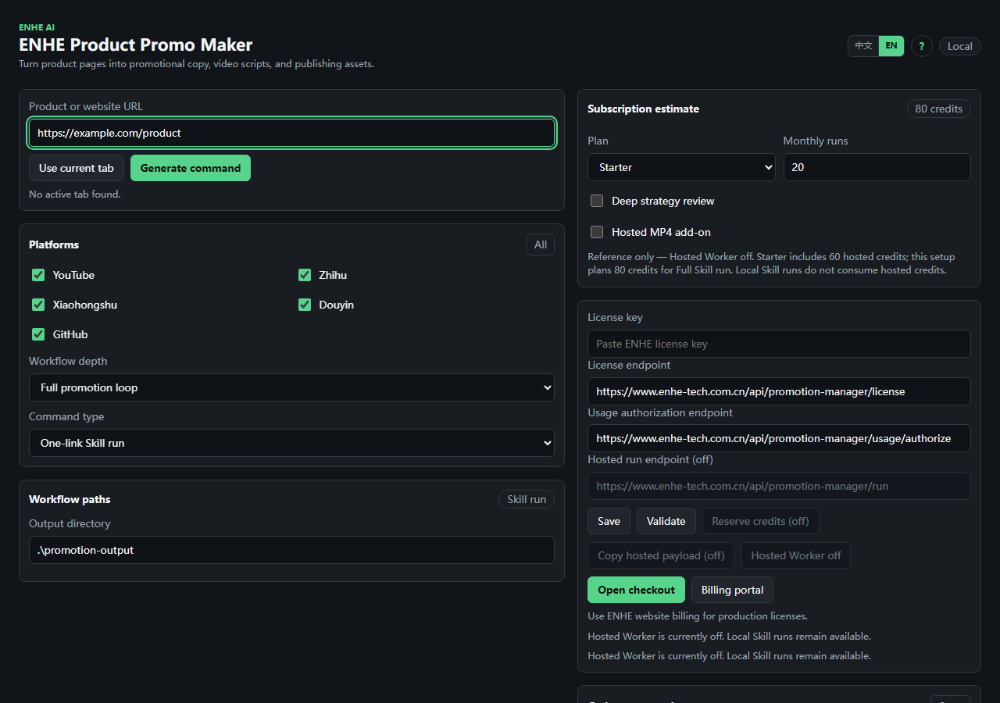

# ENHE Product Promo Maker

Turn product pages into promotional copy, video scripts, and publishing assets.

[中文](README.md) | [Official website](https://www.enhe-tech.com.cn/) | [Product page](https://www.enhe-tech.com.cn/promotion-manager) | [Chrome Web Store](https://chromewebstore.google.com/detail/enhe-promotion-manager/dloklkbnmoigemnfigbkibogmgbieppl)

Built for independent developers, product teams, content operators, and service providers: start with a product URL, prepare evidence-backed promotion materials locally, and retain control of the final publishing decision.

**Start now:** [Download the published v0.5.3 Skill ZIP](https://github.com/hqwzhu/enhe-promotion-manager/releases/download/v0.5.3/enhe-product-promo-maker-skill-0.5.3.zip) · [Download the published v0.5.3 Chrome extension ZIP](https://github.com/hqwzhu/enhe-promotion-manager/releases/download/v0.5.3/enhe-promotion-manager-extension-0.5.3.zip) · [Install from the Chrome Web Store](https://chromewebstore.google.com/detail/enhe-promotion-manager/dloklkbnmoigemnfigbkibogmgbieppl)



> A real workspace screenshot. It contains only an example URL and public endpoints, with no license, Cookie, or secret.

## Why users need it

- **Product facts are fragmented:** positioning, capabilities, audience, and proof live across product pages, help docs, and platform posts. Manual consolidation is slow and can turn assumptions into claims.
- **Every platform needs a rewrite:** YouTube, Zhihu, Xiaohongshu, Douyin, and GitHub use different structures and tones; generic copy rarely transfers cleanly.
- **Copy and production are disconnected:** spoken scripts, storyboards, cover images, detail images, and publishing fields still need separate preparation after the copy is written.
- **Publishing and learning are disconnected:** teams lack one pre-publish checklist, while real URLs, metrics, comments, orders, and revenue remain scattered after launch.

ENHE connects those steps in one local workflow. It delivers files with sources, status, missing items, and manual actions so a team can review, produce, prepare publication, and improve the next iteration without surrendering account control.

## What users get

| Result | What it does | Problem it solves | User benefit | Typical use case |
| --- | --- | --- | --- | --- |
| Product fact and evidence file | Reads public product pages, browser snapshots, and user-provided material while preserving citations, sources, and evidence status | Product information is scattered and assumptions can be presented as capabilities | Reviewable positioning, benefits, target users, and risk notes | Establish one launch narrative for a new product |
| Competitor and high-performing content research | Studies public or browser-visible competitors, creators, hooks, structures, and visible metrics | Topic choices rely on intuition and reference origins are unclear | Source-backed content directions and a list of evidence still needed | Plan the first campaign themes for a launch |
| Platform-native drafts | Creates titles, body copy, tags, and descriptions for YouTube, Zhihu, Xiaohongshu, Douyin, GitHub, and other channels | Teams rewrite the same product story repeatedly | Multiple editable channel drafts from one run | Prepare several channels for the same product |
| Video scripts and media drafts | Creates spoken scripts, storyboards, visual guidance, and optional MP4, PNG cover, and detail-image drafts when dependencies are available | Copy, filming, and design lack a shared production structure | A package that can be filmed, reviewed, and handed off | Produce a 30–60 second product walkthrough |
| Complete publishing packs | Combines copy, tags, media paths, tracking links, missing items, risk notes, and manual steps | Content and operating instructions are scattered and easy to omit | One checklist for review and handoff | Publish manually after creator or client approval |
| Real-data retrospectives | Imports real published URLs, metrics, comments, order exports, and revenue exports before comparing performance | Platform evidence is fragmented and sample numbers can be confused with results | Evidence-backed recommendations for the next iteration | Review hooks, audience response, and conversion after launch |

See the [feature catalog](docs/en/features.md) for all 16 capabilities and their factual fields. When a page cannot be read completely, a media dependency is missing, or platform access is limited, the output records `partial_ready`, `missing`, or the relevant blocked state instead of presenting unfinished work as ready.

## From product page to publishing assets

```text
Product page -> facts and evidence -> platform drafts -> video and media -> publishing pack -> real-data review
```

1. **Provide the product:** start with one public product URL, multiple links, a website entry point, or HTML saved locally.
2. **Build the evidence layer:** distinguish page facts, public platform evidence, user-imported evidence, and missing information. An optional local MediaCrawler Sidecar can support research that uses local login state.
3. **Create channel drafts:** structure titles, body copy, tags, video descriptions, and engagement prompts for each destination rather than copying one paragraph everywhere.
4. **Prepare video and images:** create spoken scripts, storyboards, and asset lists; when local Pillow, FFmpeg, and related dependencies are available, continue to PNG and MP4 drafts.
5. **Assemble the publishing pack:** combine media, fields, risk notes, missing items, and checklists. Final publishing requires manual confirmation; browser-assisted flows stop before final submission, and an approved official API gate still requires the user's credentials, account authorization, and explicit approval.
6. **Import real outcomes:** record real published URLs and real data, compare content, audience, and business evidence, then prepare recommendations for the next topic, hook, and asset set.

## Plans and audience fit

| Plan | 30-day price | Hosted credits | Best fit |
| --- | ---: | ---: | --- |
| Free | ¥0 | 5 credits | Trying the extension and local Skill workflow |
| Starter | ¥19 | 60 credits | Solo creators running occasional product campaigns |
| Growth | ¥59 | 220 credits | Individuals or small teams operating several channels consistently |
| Scale | ¥199 | 800 credits | Content teams and service providers running frequent multi-product or multi-platform work |

Local Skill runs do not require a subscription and do not consume hosted credits. Hosted credits apply only when the related service is available and its backend completes license and usage authorization. **Hosted Worker remains disabled** in this release, so these credits are not a promise of hosted execution in the current package.

The existing ENHE website manages checkout, licenses, credits, and billing. The extension retains its payment and subscription UI, but that behavior is outside the conclusion that the extension's non-payment commands match the bundled Skill.

## Trust and boundaries

- **local-first:** output is written to the local directory you choose; the public repository and Release packages do not carry runtime output.
- **Login state stays local:** Cookies, Chrome profiles, Sidecar checkout, virtual environments, and raw output are not uploaded to this public repository or its public packages.
- **Evidence-driven:** facts retain sources and status; only real URLs, metrics, comments, orders, and revenue count as real retrospective evidence.
- **The user controls platform actions:** the system does not evade CAPTCHA, login checks, or platform risk controls. Final publishing requires manual confirmation, and real writes require an explicit target, permission, and approval.
- **Hosted boundary:** Hosted Worker remains disabled; the public edition does not present hosted execution as currently available.
- **Payment parity boundary:** license, subscription, credits, and billing backends are outside the Skill/extension non-payment parity conclusion; the existing billing UI and `billing-contract.json` remain included.

[Privacy policy](https://www.enhe-tech.com.cn/promotion-manager/privacy) · [Terms](https://www.enhe-tech.com.cn/promotion-manager/terms) · [Data and privacy guide](docs/en/data-and-privacy.md) · [Email support](mailto:huqingwei5942@gmail.com)

## Start in five minutes

1. Download the published [v0.5.3 Skill ZIP](https://github.com/hqwzhu/enhe-promotion-manager/releases/download/v0.5.3/enhe-product-promo-maker-skill-0.5.3.zip), or clone the v0.5.4 source/release candidate.
2. Extract the Skill. Install the published v0.5.3 extension from the [Chrome Web Store](https://chromewebstore.google.com/detail/enhe-promotion-manager/dloklkbnmoigemnfigbkibogmgbieppl), or download the [v0.5.3 extension ZIP](https://github.com/hqwzhu/enhe-promotion-manager/releases/download/v0.5.3/enhe-promotion-manager-extension-0.5.3.zip) and follow the guide for loading the unpacked extension.
3. Open a product page, click "Use current tab" in the extension, and select the platforms and workflow depth.
4. Generate, review, and copy the local command. You can also run the Skill entry point directly without the extension.
5. Open the batch report first, then use the actual `outputDir` to review facts, copy, video, images, and publishing packs.

Minimal Windows PowerShell example:

```powershell
git clone https://github.com/hqwzhu/enhe-promotion-manager.git
cd .\enhe-promotion-manager\skill\viral-product-copy-video-generator

python scripts\skill_entry.py `
  --link "https://www.enhe-tech.com.cn/promotion-manager" `
  --platforms youtube,zhihu,xiaohongshu,douyin,github `
  --out-dir ".\promotion-output"
```

Open `promotion-output\reports\promotion-manager\batch\product-batch-runner.json` first. Its `promotionRuns` array supplies each product's actual `outputDir`, `workflowManifest`, and `publishQueue`; do not guess the run directory manually. Continue with the [installation guide](docs/en/installation.md), [quick start](docs/en/quick-start.md), and [troubleshooting guide](docs/en/troubleshooting.md).

## Creator and contact

- Brand: ENHE AI
- Creator: Hu Qingwei / 胡庆伟
- Public operating and support entity: Shenzhen Longgang District Enhe Network Technology Studio (深圳市龙岗区恩禾网络科技工作室)
- Website: https://www.enhe-tech.com.cn/
- Product page: https://www.enhe-tech.com.cn/promotion-manager
- Contact: huqingwei5942@gmail.com
- GitHub: https://github.com/hqwzhu

Report security issues privately under the [security policy](SECURITY.md). For product questions, start with [troubleshooting](docs/en/troubleshooting.md), then contact support by email.

## How the Skill and Chrome extension work together

| Component | Primary role | Best used when |
| --- | --- | --- |
| Chrome extension | After a user click, reads the current tab URL and title, lets the user choose platforms, workflow depth, and command type, then creates a reviewable local command | You are viewing a product page and want to create a task quickly |
| Codex Skill | Reads the product, researches evidence, creates content and media drafts, organizes publishing packs, imports real data, and runs retrospectives | You need complete execution, file deliverables, and an audit trail |

The extension can generate commands on its own, and the Skill can run directly without the extension. They share 11 non-payment commands; payment, subscription, license, credits, and billing behavior remain a separate scope. See the [extension guide](docs/en/extension-guide.md), [Skill guide](docs/en/skill-guide.md), and [version synchronization guide](docs/en/version-sync.md).

## Supported platforms and current boundaries

| Platform or source | Current path | Primary boundary |
| --- | --- | --- |
| Product pages and websites | Static reads, Playwright browser snapshots, site-link discovery, sitemaps, or HTML saved by the user | Dynamic pages may require Chromium; private pages behind login are not default public sources |
| YouTube | Public pages, public or official data paths, content drafts, official API dry-run, and credential checks | A real upload requires user credentials, platform authorization, and explicit approval |
| GitHub | Public repository evidence, README/Issue/Release drafts, and controlled official paths | Confirm the target, permission, and approval before writing to a real repository |
| Zhihu, Xiaohongshu, and Douyin | Public or browser-visible pages, user exports, and an optional local Sidecar using local login state | Login, CAPTCHA, risk controls, and publishing permissions remain external platform gates |

Research uses only public, browser-visible, officially authorized, or user-provided data. See [platform research](docs/en/platform-research.md) and [publishing and review](docs/en/publishing-and-review.md) for the operating details.

## Current version and downloads

- Public repository, Skill, and extension source/release candidate: `0.5.4`
- Current public Chrome Web Store version: `0.5.3` (published)
- v0.5.4 has not yet been submitted to the Chrome Web Store for review.
- [Download published Skill v0.5.3](https://github.com/hqwzhu/enhe-promotion-manager/releases/download/v0.5.3/enhe-product-promo-maker-skill-0.5.3.zip)
- [Download published Chrome extension v0.5.3](https://github.com/hqwzhu/enhe-promotion-manager/releases/download/v0.5.3/enhe-promotion-manager-extension-0.5.3.zip)
- [View all GitHub Releases](https://github.com/hqwzhu/enhe-promotion-manager/releases)
- [Existing Chrome Web Store listing](https://chromewebstore.google.com/detail/enhe-promotion-manager/dloklkbnmoigemnfigbkibogmgbieppl)

## License and third-party components

`LICENSE` records `Copyright (c) 2026 HU`. `HU` is the code copyright identifier/rightsholder shown in the MIT license. `ENHE AI` is the product brand and creator identity. Shenzhen Longgang District Enhe Network Technology Studio (深圳市龙岗区恩禾网络科技工作室) is the public operating and support entity. The scope and terms of the grant are controlled by `LICENSE`; these identity notes do not change the license or infer that the operating entity owns the code copyright.

Third-party runtimes and upstream dependencies remain subject to their own licenses. MediaCrawler is a separate upstream project and is not covered by this repository's MIT grant. Commercial authorization for ENHE does not automatically relicense MediaCrawler source code to public users. Users must follow the upstream license, platform terms, and applicable law. See [NOTICE](NOTICE.md).
