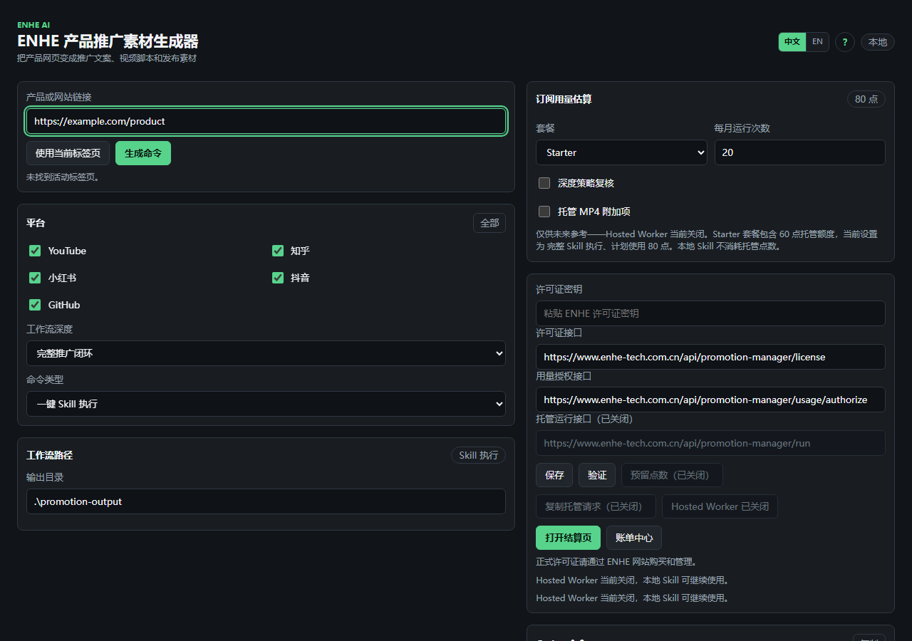

# ENHE 产品推广素材生成器

把产品网页变成推广文案、视频脚本和发布素材。

[English](README.en.md) | [官方网站](https://www.enhe-tech.com.cn/) | [产品页面](https://www.enhe-tech.com.cn/promotion-manager) | [Chrome 商店](https://chromewebstore.google.com/detail/enhe-promotion-manager/dloklkbnmoigemnfigbkibogmgbieppl)

面向独立开发者、产品团队、内容运营和服务商：从一个产品 URL 开始，在本机完成事实整理、证据研究、多平台内容准备和真实数据复盘，同时由你保留最终发布控制权。

**立即开始：** [下载 Skill ZIP](https://github.com/hqwzhu/enhe-promotion-manager/releases/download/v0.5.3/enhe-product-promo-maker-skill-0.5.3.zip) · [下载 Chrome 插件 ZIP](https://github.com/hqwzhu/enhe-promotion-manager/releases/download/v0.5.3/enhe-promotion-manager-extension-0.5.3.zip) · [从 Chrome 商店安装](https://chromewebstore.google.com/detail/enhe-promotion-manager/dloklkbnmoigemnfigbkibogmgbieppl)



> 真实工作台截图。示例 URL 和接口均为公开地址，截图不包含许可证、Cookie 或密钥。

## 为什么用户需要它

- **产品事实散落：** 卖点、功能、目标用户和证明材料分散在产品页、帮助文档与平台内容中，人工汇总慢，也容易把推测写成事实。
- **跨平台重复改写：** YouTube、知乎、小红书、抖音和 GitHub 的表达方式不同，同一段通用文案很难直接复用。
- **内容与素材脱节：** 文案完成后，视频口播、分镜、封面、详情图和发布字段仍要重新整理。
- **发布与复盘断裂：** 发布前缺少统一清单，发布后真实 URL、指标、评论、订单和收入又散落在不同入口。

ENHE 把这些步骤串成一条本地工作流。它不是替你做不可审查的黑箱操作，而是交付带来源、状态、缺失项和人工步骤的文件，让团队更快完成核对、制作、发布准备与下一轮迭代。

## 用户可以得到什么

| 结果 | 它做什么 | 解决什么问题 | 用户收益 | 典型场景 |
| --- | --- | --- | --- | --- |
| 产品事实与证据档案 | 读取公开产品页、浏览器快照和用户提供的资料，保留引用、来源与证据状态 | 产品信息分散，推测容易被写成能力 | 得到可复核的定位、卖点、目标用户和风险提示 | 新产品上线前整理统一口径 |
| 竞品与高表现内容研究 | 研究公开或浏览器可见的竞品、创作者、钩子、结构和可见指标 | 选题只凭感觉，不知道参考来自哪里 | 得到带来源的内容方向和待补证据清单 | 为新品规划首轮推广主题 |
| 多平台文案 | 为 YouTube、知乎、小红书、抖音、GitHub 等生成适配的标题、正文、标签和简介 | 每个平台都要重新改写 | 一次运行得到多套可继续编辑的草稿 | 同一产品同步准备多个渠道 |
| 视频脚本与素材草稿 | 生成口播稿、分镜、画面建议；依赖可用时输出 MP4、PNG 封面和详情图 | 文字、拍摄和设计没有共同结构 | 得到可拍、可审、可交接的制作清单 | 制作 30–60 秒产品演示视频 |
| 完整发布包 | 汇总文案、标签、媒体路径、跟踪链接、缺失项、风险提示和人工步骤 | 内容与发布说明散落，容易漏项 | 一份清单即可审核并交接 | 创作者或客户批准后手动发布 |
| 真实数据复盘 | 导入真实发布 URL、指标、评论、订单和收入导出，再比较内容表现 | 平台数据分散，示例数字容易与实绩混淆 | 用真实证据形成下一轮优化建议 | 发布后复盘钩子、受众与转化 |

完整 16 项能力和事实字段见 [功能目录](docs/zh-CN/features.md)。页面读取不完整、媒体依赖缺失或平台访问受限时，结果会明确标记 `partial_ready`、`missing` 或相应阻塞状态，方便继续补采，不会把未完成结果伪装成就绪。

## 从网页到发布素材

```text
产品网页 -> 事实与证据 -> 平台文案 -> 视频脚本与素材 -> 发布包 -> 真实数据复盘
```

1. **输入产品：** 使用一个公开产品 URL，也可以提供多个链接、网站入口或本地保存的 HTML。
2. **建立证据：** 区分页面事实、公开平台证据、用户导入证据与缺失信息；需要登录态研究时，可选用本机 MediaCrawler Sidecar。
3. **生成渠道草稿：** 按目标平台分别组织标题、正文、标签、视频简介和互动提示，而不是复制同一段文字。
4. **准备视频与图片：** 生成口播稿、分镜和素材清单；Pillow、FFmpeg 等本机依赖可用时继续生成 PNG 与 MP4 草稿。
5. **形成发布包：** 汇总媒体、字段、风险、缺失项和检查清单。最终发布人工确认；浏览器辅助流程停在最后提交前，官方 API gate 也需要用户凭据、账号授权和明确批准。
6. **导入真实结果：** 登记真实发布 URL 与真实数据，比较内容、受众和业务证据，形成下一轮选题、钩子与素材建议。

## 套餐与适用人群

| 套餐 | 30 天价格 | 托管额度 | 适合谁 |
| --- | ---: | ---: | --- |
| Free | ¥0 | 5 点 | 体验插件和本地 Skill 工作流 |
| Starter | ¥19 | 60 点 | 偶尔开展产品推广的独立创作者 |
| Growth | ¥59 | 220 点 | 持续运营多个平台的个人或小团队 |
| Scale | ¥199 | 800 点 | 跨产品、跨平台高频运营的内容团队和服务商 |

本地 Skill 运行不要求订阅，也不消耗托管额度。托管额度只在相关服务可用、且后端完成许可证和用量校验时使用；当前版本 **Hosted Worker 保持关闭**，因此这些额度不代表本版本已经提供托管运行。

购买、许可证、点数和账单由 ENHE 网站的现有流程管理。扩展中的支付与订阅 UI 仍保留，但这部分不纳入“插件非支付命令与随包 Skill 保持同步”的结论。

## 信任与边界

- **本地优先：** 输出默认写入你指定的本地目录，公开仓库和 Release 安装包不携带运行输出。
- **登录态留在本机：** Cookies、Chrome profile、Sidecar checkout、虚拟环境和原始输出不上传到本公开仓库或公开安装包。
- **证据驱动：** 事实保留来源与状态；只有真实 URL、指标、评论、订单和收入才作为真实复盘证据。
- **平台控制权归用户：** 系统不规避验证码、登录检查或平台风险控制。最终发布人工确认，真实写入还需要目标、权限和批准都明确。
- **托管边界明确：** Hosted Worker 保持关闭；公开版不把托管执行描述为当前可用能力。
- **支付同步边界明确：** 许可证、订阅、点数和账单后端不纳入 Skill/插件非支付功能同步结论；扩展现有 billing UI 与 `billing-contract.json` 继续保留。

[隐私政策](https://www.enhe-tech.com.cn/promotion-manager/privacy) · [使用条款](https://www.enhe-tech.com.cn/promotion-manager/terms) · [数据与隐私说明](docs/zh-CN/data-and-privacy.md) · [邮件支持](mailto:huqingwei5942@gmail.com)

## 五分钟开始使用

1. 下载 [Skill ZIP](https://github.com/hqwzhu/enhe-promotion-manager/releases/download/v0.5.3/enhe-product-promo-maker-skill-0.5.3.zip)，或克隆公开仓库。
2. 解压 Skill；插件可从 [Chrome 商店](https://chromewebstore.google.com/detail/enhe-promotion-manager/dloklkbnmoigemnfigbkibogmgbieppl) 安装，也可下载 [插件 ZIP](https://github.com/hqwzhu/enhe-promotion-manager/releases/download/v0.5.3/enhe-promotion-manager-extension-0.5.3.zip) 后按指南加载未打包扩展。
3. 打开产品页，在插件中点击“使用当前标签页”，选择平台和工作流深度。
4. 生成、检查并复制本地命令；也可以不使用插件，直接在 Skill 目录运行入口脚本。
5. 先查看批次报告，再按实际 `outputDir` 审核事实、文案、视频、图片和发布包。

Windows PowerShell 最小示例：

```powershell
git clone https://github.com/hqwzhu/enhe-promotion-manager.git
cd .\enhe-promotion-manager\skill\viral-product-copy-video-generator

python scripts\skill_entry.py `
  --link "https://www.enhe-tech.com.cn/promotion-manager" `
  --platforms youtube,zhihu,xiaohongshu,douyin,github `
  --out-dir ".\promotion-output"
```

先打开 `promotion-output\reports\promotion-manager\batch\product-batch-runner.json`。其中 `promotionRuns` 会给出每个产品真实的 `outputDir`、`workflowManifest` 和 `publishQueue`；不要手工猜测运行目录。详细步骤见 [安装指南](docs/zh-CN/installation.md)、[快速开始](docs/zh-CN/quick-start.md) 和 [故障排查](docs/zh-CN/troubleshooting.md)。

## 创作者与联系

- 品牌：ENHE AI
- 创作者：胡庆伟
- 公开运营与支持主体：深圳市龙岗区恩禾网络科技工作室
- 网站：https://www.enhe-tech.com.cn/
- 产品页面：https://www.enhe-tech.com.cn/promotion-manager
- 联系邮箱：huqingwei5942@gmail.com
- GitHub：https://github.com/hqwzhu

安全问题请按 [安全政策](SECURITY.md) 私下报告；产品问题可先查看 [故障排查](docs/zh-CN/troubleshooting.md)，再通过邮件联系。

## Skill 与 Chrome 插件如何配合

| 组件 | 主要作用 | 适合什么时候用 |
| --- | --- | --- |
| Chrome 插件 | 在用户点击后读取当前标签页 URL 和标题，选择平台、工作流深度与命令类型，生成可检查、可复制的本地命令 | 正在浏览产品页，希望快速建立任务时 |
| Codex Skill | 读取产品、研究证据、生成内容和媒体草稿、组织发布包、导入真实数据并复盘 | 需要完整执行、文件交付和审计记录时 |

插件可以单独生成命令，Skill 也可以不依赖插件直接运行。两者共享 11 项非支付命令；支付、订阅、许可证、点数和账单行为属于独立范围。完整说明见 [插件指南](docs/zh-CN/extension-guide.md)、[Skill 指南](docs/zh-CN/skill-guide.md) 和 [版本同步说明](docs/zh-CN/version-sync.md)。

## 支持的平台和当前边界

| 平台/来源 | 当前可用路径 | 主要边界 |
| --- | --- | --- |
| 产品网页与网站 | 静态读取、Playwright 浏览器快照、站点链接发现、站点地图或用户保存的 HTML | 动态页面可能需要 Chromium；登录后的私有页面不作为默认公共来源 |
| YouTube | 公开页面、公开或官方数据路径、内容草稿、官方 API dry-run 与凭据检查 | 真实上传需要用户凭据、平台授权和明确批准 |
| GitHub | 公开仓库证据、README/Issue/Release 草稿与受控官方路径 | 写入真实仓库前确认目标、权限和批准 |
| 知乎、小红书、抖音 | 公开或浏览器可见页面、用户导出、可选本机 Sidecar 登录态 | 登录、验证码、风险控制和发布权限属于平台外部门槛 |

研究只使用公开、浏览器可见、官方授权或用户主动提供的数据。更多说明见 [平台研究](docs/zh-CN/platform-research.md) 和 [发布与复盘](docs/zh-CN/publishing-and-review.md)。

## 当前版本与下载

- 公开仓库、Skill 和扩展源码：`0.5.3`
- Chrome 商店当前公开版本（本次更新前）：`0.5.2`
- [下载 Skill v0.5.3](https://github.com/hqwzhu/enhe-promotion-manager/releases/download/v0.5.3/enhe-product-promo-maker-skill-0.5.3.zip)
- [下载 Chrome 插件 v0.5.3](https://github.com/hqwzhu/enhe-promotion-manager/releases/download/v0.5.3/enhe-promotion-manager-extension-0.5.3.zip)
- [查看全部 GitHub Releases](https://github.com/hqwzhu/enhe-promotion-manager/releases)
- [Chrome 商店现有条目](https://chromewebstore.google.com/detail/enhe-promotion-manager/dloklkbnmoigemnfigbkibogmgbieppl)

## 开源许可与第三方组件

`LICENSE` 当前记录 `Copyright (c) 2026 HU`；`HU` 是该许可文件显示的代码版权标识/权利人，`ENHE AI` 是产品品牌与创作者身份，`深圳市龙岗区恩禾网络科技工作室` 是公开运营与支持主体。授权范围与条件以 `LICENSE` 为准；这些身份说明不修改许可，也不推断运营主体拥有代码版权。

第三方运行时和上游依赖遵循各自许可证。MediaCrawler 是独立上游项目，不属于本仓库 MIT 授权范围；面向 ENHE 的商业授权不会自动把 MediaCrawler 源码再授权给公开用户。使用者需自行遵守其上游许可证、平台条款与适用法律，详见 [NOTICE](NOTICE.md)。
